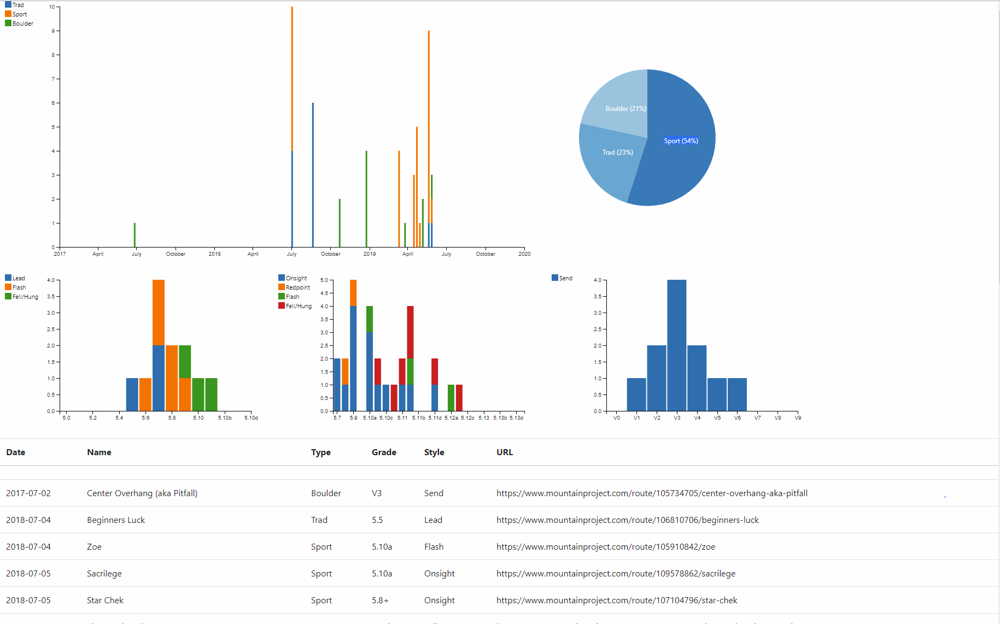

Route pyramid visualizer built using dc.js and flask.

Currently deployed at `http://mountainproject.caleb.wang/pyramid/<mountain_project_user_id>`.

Installation
 - Install python3 and node
 - `python3 -m venv virtualenv`
 - `pip install -r requirements.txt` 
 - manually install my [mountainproject](https://github.com/calebwang/mountainproject) API.
 - `cd site && npm install`

Commands
 - `cd site && npm run build` build JS artifacts
 - `bin/run-dev` run development flask server
